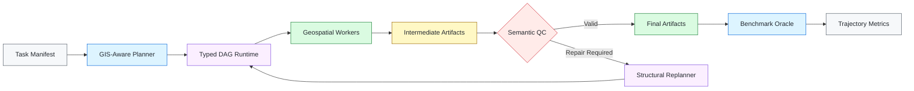
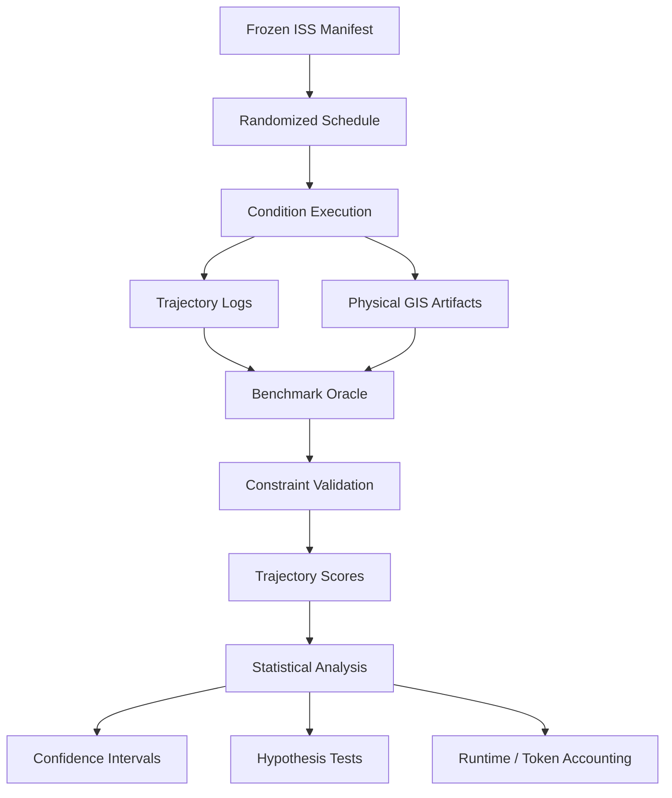

<div align="center">

### Geospatial Agent Orchestration

**Reference implementation and evaluation framework for autonomous, multi-agent geospatial pipelines.**

<br>


<br><br>

[**Overview**](#benchmark-overview) ·
[**Architecture**](#system-architecture) ·
[**Conditions**](#experimental-conditions) ·
[**Results**](#results-summary) ·
[**Installation**](#installation--setup) ·
[**Reproduce**](#reproducing-the-benchmark) ·
[**Analysis**](#statistical-analysis)

</div>


##  Benchmark Overview

The **Geospatial Agent Orchestrator** is a reference architecture for executing geospatial workflows through planning, typed precondition verification, schema grounding, intermediate validation, and structural replanning.

The accompanying **Isolated Skills Suite (ISS)** benchmark evaluates how different orchestration capabilities affect end-to-end execution across realistic multi-step GIS workflows.

<table>
<tr>
<td align="center" width="25%">
<strong>30</strong><br>
<sub>Geospatial Tasks</sub>
</td>
<td align="center" width="25%">
<strong>6</strong><br>
<sub>Experimental Conditions</sub>
</td>
<td align="center" width="25%">
<strong>3</strong><br>
<sub>Independent Runs</sub>
</td>
<td align="center" width="25%">
<strong>540</strong><br>
<sub>Total Trajectories</sub>
</td>
</tr>
</table>

### What the benchmark measures

| Capability                                                                                         | Evaluation Target                                                           |
| -------------------------------------------------------------------------------------------------- | --------------------------------------------------------------------------- |
|  **Planning**                    | Construction of executable multi-step GIS workflows                         |
|  **Typed Preconditions**  | Validation of operation requirements before execution                       |
|  **Schema Grounding**         | Dynamic resolution of layers, fields, geometry, CRS, and artifact structure |
|  **Semantic QC**           | Inspection and validation of intermediate geospatial outputs                |
|  **Structural Replanning**  | Dynamic graph repair when execution assumptions fail                        |
|  **Artifact Completion** | Production of valid GeoPackages, GeoTIFFs, CSVs, and HTML maps              |
|  **Fault Tolerance**            | Recovery from execution, schema, and workflow failures                      |

---

##  System Architecture



> [!NOTE]
> The benchmark uses ablations of the planner, quality-control layer, and structural replanner to isolate the contribution of each orchestration capability.

---

##  Experimental Conditions

All conditions use the same task suite and evaluation protocol.

| Condition | Evaluation Role                 |     Planner     |        QC       |    Replanner    |
| :-------: | ------------------------------- | :-------------: | :-------------: | :-------------: |
|  **`C0`** | External Baseline               |    *External*   |    *External*   |    *External*   |
|  **`C1`** | Matched Domain-Neutral          |    `generic`    |    `generic`    |    `generic`    |
|  **`C2`** | Planning Ablation               |    `generic`    |   `gis_aware`   |   `gis_aware`   |
|  **`C3`** | Replanning Ablation             |   `gis_aware`   |   `gis_aware`   |      `none`     |
|  **`C4`** | QC Ablation                     |   `gis_aware`   |      `none`     |   `gis_aware`   |
|  **`C5`** | **Full GIS-Aware Orchestrator** | **`gis_aware`** | **`gis_aware`** | **`gis_aware`** |

<details>
<summary><strong>View detailed condition descriptions</strong></summary>

<br>

### `C0` — External Baseline

**AutoGen Magentic-One multi-agent loop baseline** without domain-specific GAS orchestration.

---

### `C1` — Matched Domain-Neutral

Architecture-matched control condition operating within the GAS DAG runtime without GIS-specific domain rules.

* Planner: `generic`
* QC: `generic`
* Replanner: `generic`

---

### `C2` — No GIS-Aware Planning

Replaces the GIS-specific planner with a generic planner while preserving GIS-aware QC and structural replanning.

This condition tests whether runtime validation and graph repair can recover from domain-uninformed plans.

* Planner: `generic`
* QC: `gis_aware`
* Replanner: `gis_aware`

---

### `C3` — No Structural Replanning

Disables dynamic structural graph patching and self-healing while retaining GIS-aware planning and semantic validation.

* Planner: `gis_aware`
* QC: `gis_aware`
* Replanner: `none`

---

### `C4` — No GIS Semantic Validation

Disables intermediate semantic quality control, evidence inspection, and dynamic schema grounding.

* Planner: `gis_aware`
* QC: `none`
* Replanner: `gis_aware`

---

### `C5` — Full GIS-Aware Orchestrator

The complete proposed system.

It combines:

* GIS-specific planning
* Typed precondition verification
* Dynamic schema grounding
* Intermediate semantic QC
* Evidence inspection
* Structural replanning
* Runtime self-repair

</details>

---

#  Results Summary

<div align="center">

### `gpt-5.6-luna` · Isolated Skills Suite

Evaluated by the deterministic **Benchmark Oracle** against physical on-disk geospatial artifacts.

<br>


</div>

<br>

| Condition | Description                     | Passed / Total | Success Rate | Task Score Distribution                     |
| :-------: | ------------------------------- | :------------: | -----------: | ------------------------------------------- |
|    `C0`   | Magentic-One Baseline           |   **13 / 90**  |   **14.44%** | `0/3`: 24 · `1/3`: 2 · `2/3`: 1 · `3/3`: 3  |
|    `C1`   | Matched Domain-Neutral          |   **45 / 90**  |   **50.00%** | `0/3`: 14 · `1/3`: 1 · `2/3`: 1 · `3/3`: 14 |
|    `C2`   | No GIS-Aware Planning           |   **50 / 90**  |   **55.56%** | `0/3`: 10 · `1/3`: 3 · `2/3`: 4 · `3/3`: 13 |
|    `C3`   | No Structural Replanning        |   **52 / 90**  |   **57.78%** | `0/3`: 8 · `1/3`: 4 · `2/3`: 6 · `3/3`: 12  |
|    `C4`   | No GIS Semantic Validation      |   **57 / 90**  |   **63.33%** | `0/3`: 3 · `1/3`: 7 · `2/3`: 10 · `3/3`: 10 |
|  **`C5`** | **Full GIS-Aware Orchestrator** |   **62 / 90**  |   **68.89%** | `0/3`: 5 · `1/3`: 0 · `2/3`: 13 · `3/3`: 12 |

### Observed Pass Rates

```text
C0  External Baseline             14.44%  ███████
C1  Domain-Neutral                50.00%  █████████████████████████
C2  − GIS Planning                55.56%  ████████████████████████████
C3  − Structural Replanning       57.78%  █████████████████████████████
C4  − Semantic QC                 63.33%  ████████████████████████████████
C5  Full GAS                      68.89%  ██████████████████████████████████
```

> [!TIP]
> Within these reported runs, `C5` achieves **68.89% trajectory completion**, compared with **50.00%** for the architecture-matched domain-neutral `C1` condition and **14.44%** for the external `C0` baseline.

###  Benchmark Oracle

The deterministic evaluation layer validates the actual spatial artifacts produced during each trajectory rather than relying on model-generated self-assessments.

Evaluated artifacts include:

* **GeoPackage** — `.gpkg`
* **GeoTIFF** — `.tif`
* **Tabular outputs** — `.csv`
* **Interactive maps** — `.html`
* Spatial schema
* Geometry
* CRS
* Expected fields
* Output constraints
* Task-specific artifact properties

---

##  Repository Structure

```text
GAS-Project/
│
├── .env.example
├── requirements.txt
├── LICENSE
├── README.md
│
├── benchmark/
│   ├── run_luna_experiment.py
│   │   └── Main CLI runner for the gpt-5.6-luna benchmark
│   │
│   ├── runner.py
│   │   └── Schedule generator and headless execution kernel
│   │
│   ├── progressive_executor.py
│   │   └── Pipeline execution state engine
│   │
│   ├── baselines/
│   │   └── AutoGen Magentic-One C0 adapter
│   │
│   ├── evaluation/
│   │   ├── Benchmark Oracle
│   │   ├── Constraint dispatcher
│   │   └── Statistical analysis
│   │
│   ├── manifests/
│   │   └── 30 isolated benchmark tasks and constraints
│   │
│   ├── results/
│   │   └── [result_folder_name]/
│   │       ├── 540 trajectory logs
│   │       └── Analysis reports
│   │
│   └── fixtures/
│       └── Frozen spatial fixtures (.gpkg, .tif, .csv)
│
├── gas_client/
│   └── Python client SDK
│
├── gas_server/
│   ├── Core orchestrator
│   ├── Worker tools
│   └── Service registry
│
└── Data/
    └── Ephemeral execution outputs
```

---

#  Installation & Setup

## 1. Clone the Repository

```bash
git clone https://github.com/your-username/gas-project.git
cd gas-project
```

## 2. Create a Virtual Environment

### Linux / macOS

```bash
python -m venv .venv
source .venv/bin/activate
```

### Windows

```powershell
python -m venv .venv
.venv\Scripts\activate
```

## 3. Install Dependencies

```bash
pip install -r requirements.txt
```

## 4. Configure the API Key

Copy the environment template:

```bash
cp .env.example .env
```

Then edit `.env`:

```env
OPENAI_API_KEY=your_openai_api_key_here
```

---

#  Reproducing the Benchmark

## Full ISS Benchmark

Run the complete randomized schedule across all six experimental conditions and three repetitions:

```bash
python benchmark/run_luna_experiment.py \
  --suite isolated \
  --conditions C0,C1,C2,C3,C4,C5 \
  --runs 3 \
  --seed 42 \
  --output-dir benchmark/results/[result_folder_name]
```

This executes:

```text
30 tasks
× 6 conditions
× 3 independent runs
────────────────────
540 trajectories
```

---

#  Statistical Analysis

The evaluation pipeline supports:

* Paired sign-flip hypothesis tests
* Bootstrap **95% confidence intervals**
* Trajectory-level pass-rate analysis
* Runtime accounting
* Token/resource accounting
* Failure provenance analysis
* C5 failure export

## Generate the Trajectory-Level Analysis

```bash
python benchmark/evaluation/analysis.py \
  --results-dir benchmark/results/[result_folder_name] \
  --output-json benchmark/results/[result_folder_name]/trajectory_level_analysis_report.json
```

The generated report summarizes trajectory-level benchmark performance and statistical comparisons.

---

##  Export Supplementary Artifacts

Generate the manuscript's supplementary runtime/token table and provenance-correct C5 failure export directly from the frozen raw logs:

```bash
python benchmark/evaluation/export_supplementary_artifacts.py \
  --results-dir benchmark/results/[result_folder_name] \
  --manifest benchmark/manifests/isolated_suite.json
```

---

##  Evaluation Pipeline



---

##  Reproducibility

The repository is structured to preserve benchmark provenance through:

| Component             | Purpose                                          |
| --------------------- | ------------------------------------------------ |
| **Frozen Fixtures**   | Stable geospatial source data                    |
| **Task Manifest**     | Machine-readable task and constraint definitions |
| **Seeded Scheduling** | Reproducible execution ordering                  |
| **Trajectory Logs**   | Complete execution history                       |
| **Artifact Oracle**   | Deterministic physical-output verification       |
| **Analysis Scripts**  | Reproducible statistical calculations            |

### Case D data availability

The two large GeoPackages supporting the goal-oriented Section 6 case are public external downloads. Their URLs, checksums, purposes, and expected local paths are recorded in the [Case D data-availability record](./Analytical%20Specification%20Case%20Study/Case_D_Goal_Oriented/DATA_AVAILABILITY.md).

---

##  Core Components

<table>
<tr>
<td width="50%" valign="top">

<h3>

Orchestrator
</h3>

Constructs and manages the execution graph for complex geospatial workflows.


</td>

<td width="50%" valign="top">

<h3>

Semantic QC
</h3>

Validates intermediate outputs before downstream execution.


</td>
</tr>

<tr>
<td width="50%" valign="top">

<h3>

Structural Replanner
</h3>

Repairs execution graphs when runtime assumptions fail.


</td>

<td width="50%" valign="top">

<h3>

Benchmark Oracle
</h3>

Performs deterministic evaluation of generated artifacts.


</td>
</tr>
</table>


---

<div align="center">

### Geospatial Agent Orchestration

`Planning` · `Grounding` · `Validation` · `Replanning` · `Execution`

<br>


<br><br>

<a href="#geospatial-agentic-services">Back to top ↑</a>

</div>
